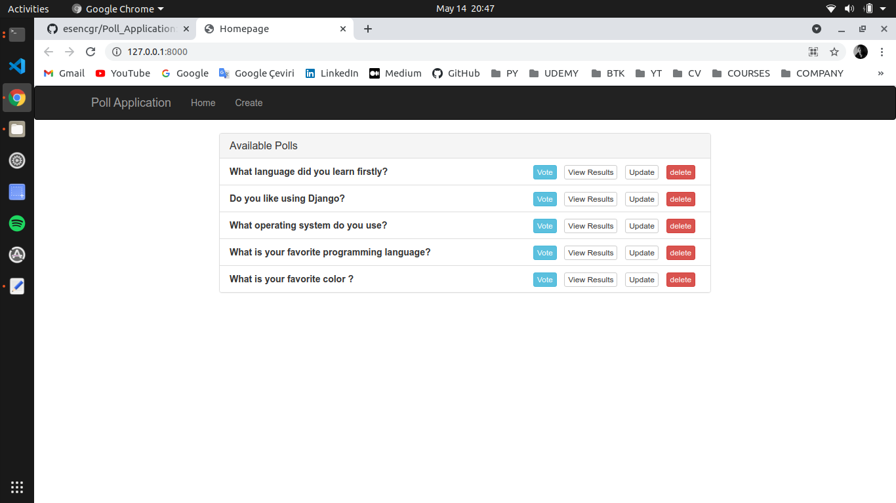

# Poll_Application
## POLL APP WITH DJANGO

### Clone This Project (Make Sure You Have Git Installed)
```
https://github.com/esencgr/Poll_Application.git
```
### Install Dependencies 

```
pip install -r requirements.txt
```

### Set Database (Make Sure you are in directory same as manage.py)
```
python manage.py makemigrations
python manage.py migrate
```

### An EndUser participates in the survey and observes the results.(home - vote - results pages available)
```
python manage.py runserver
```

### Pages for Enduser

#### HOME 


#### VOTE 


#### RESULTS 


### Create SuperUser for Administration(home - vote - results - create - delete pages available)
```
python manage.py createsuperuser
python manage.py runserver
```
### Pages for Admin

#### HOME 



#### CREATE


#### UPDATE 


After all these steps , you can start testing and developing this project. 
