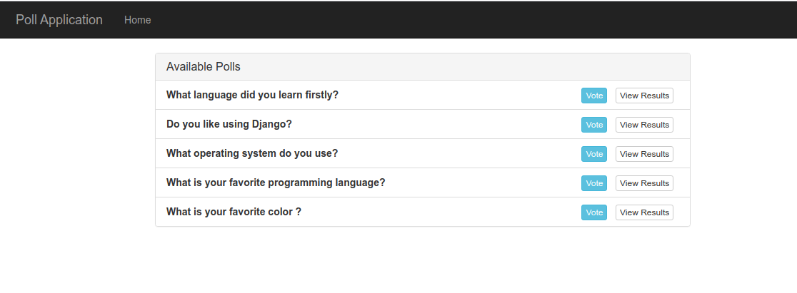
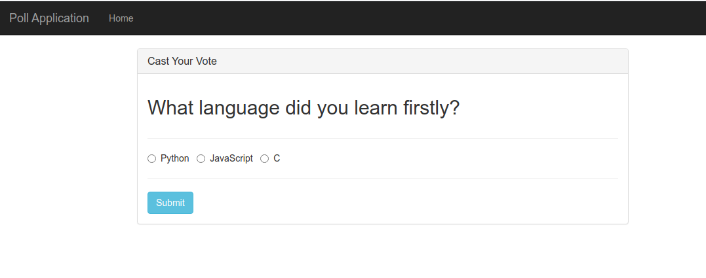
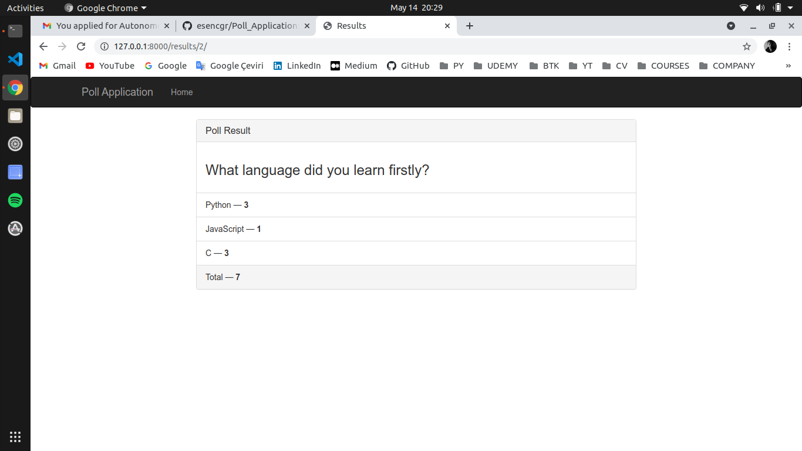
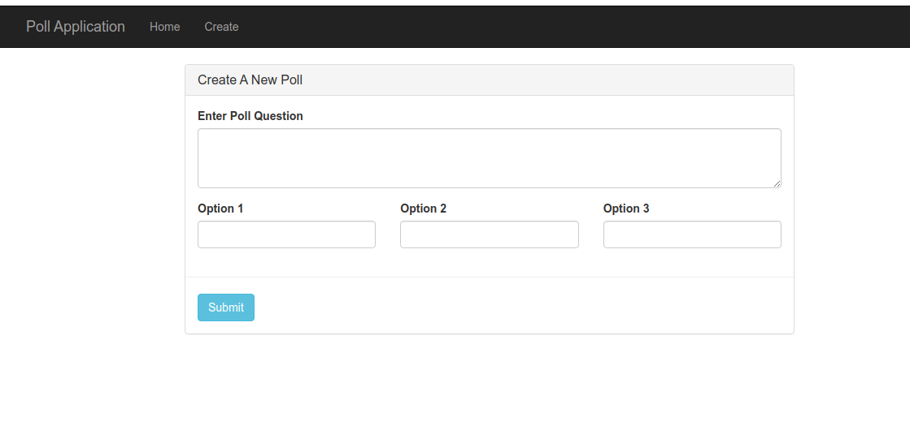
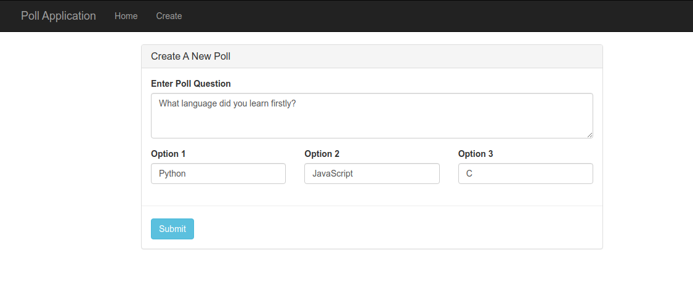

# Poll_Application
Poll Application with Django

Clone This Project (Make Sure You Have Git Installed)
```
https://github.com/esencgr/Poll_Application.git
```
Install Dependencies 

```
pip install -r requirements.txt
```

Set Database (Make Sure you are in directory same as manage.py)
```
python manage.py makemigrations
python manage.py migrate
```

An EndUser participates in the survey and observes the results.
```
python manage.py runserver
```

Pages for Enduser

HOME 



VOTE 



RESULTS 




Create SuperUser for Administration(for create, delete, update polls)
```
python manage.py createsuperuser
python manage.py runserver
```
Pages for Admin

HOME 


CREATE



UPDATE 




After all these steps , you can start testing and developing this project. 
