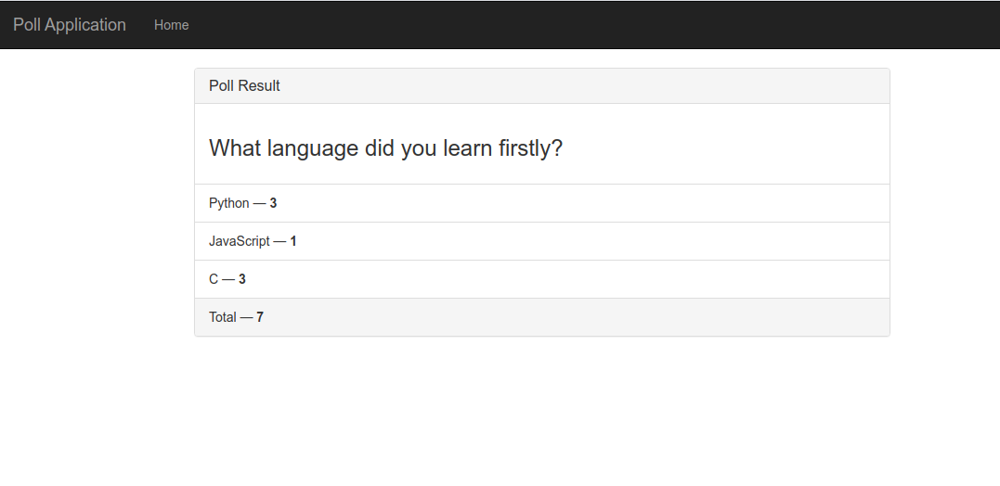
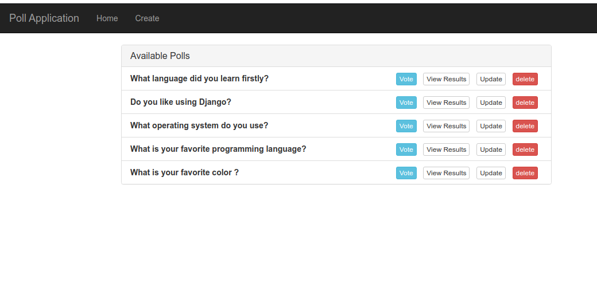

## DJANGO FRAMEWORK OVERVIEW

Django is an open-source framework for backend web applicaitons based on Python - one of the top web development languages

### DJANGO ADVANTAGES

* Admin Panel
* Pluggable
* Libraries
* Object-Relational-Mapper(ORM) : ORM provides a bridge between relational database tables, relationships and python objects.
* Flask - mini framework
* Detail Error Explanations
* User System 
* Rich Ecosystem
* Maturity
* Security
* Good for SEO
* Model-View-Template Architecture (MVT)


---------------------------------------------
 
## POLL APP WITH DJANGO

### Clone This Project (Make Sure You Have Git Installed)
```
https://github.com/esencgr/Poll_Application.git
```
### Install Dependencies 

```
pip install -r requirements.txt
```

### Set Database (Make Sure you are in directory same as manage.py)
```
python manage.py makemigrations
python manage.py migrate
```

### An EndUser participates in the survey and observes the results.(home - vote - results pages available)
```
python manage.py runserver
```

### Pages for Enduser

#### HOME 


#### VOTE 


#### RESULTS 




### Create SuperUser for Administration(home - vote - results - create - delete pages available)
```
python manage.py createsuperuser
python manage.py runserver
```
### Pages for Admin

#### HOME 



#### CREATE


#### UPDATE 


After all these steps , you can start testing and developing this project. 
